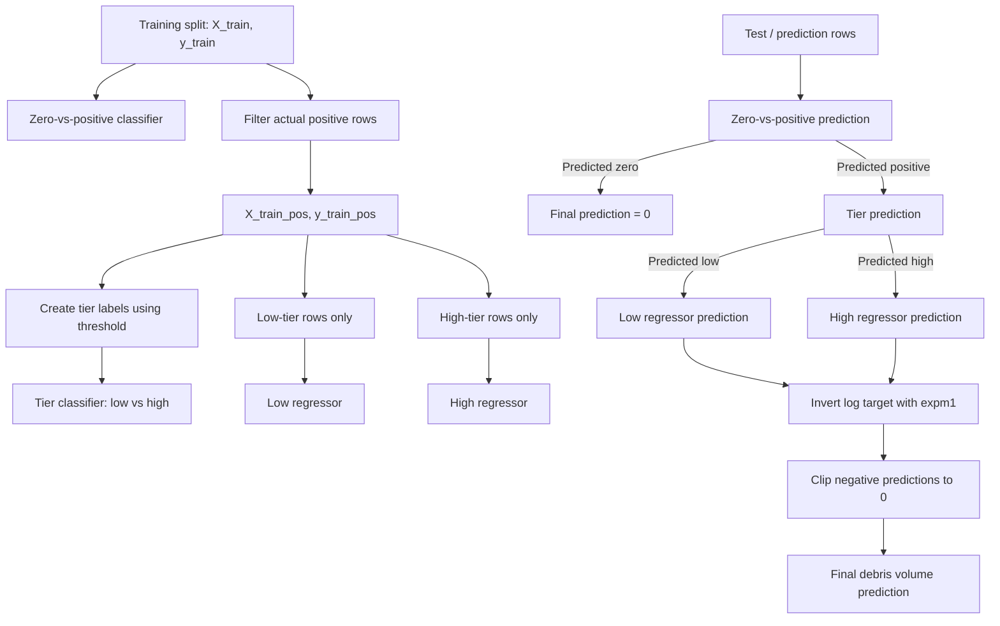

# Debris Estimation

## Project Summary

A modular machine learning pipeline for estimating post-disaster debris volume using staged classification and regression models on geospatial and structural data.

## Setup

Create a python virtual environment

```bash
python3 -m venv .venv
source .venv/bin/activate
```

Install dependencies

```bash
pip install -e .
```

## Project Structure

The repository is structured to separate preprocessing, splitting, modeling, evaluation, plotting, and experiment scripts into reusable modules under `src/`.

```text
docs/
  experiments.md       # future experiment ideas and notes
  roadmap.md           # implementation direction
notebooks/             # legacy; core logic extracted
outputs/               # model run outputs; metrics and plots
scripts/
  run_smoke_test.py    # one-clip, one-threshold staged model smoke check
src/
  debris_estimate/
    clipping.py        # target clipping
    data.py            # dataset loading
    evaluation.py      # model evaluation
    logger.py          # process wide logging
    metrics.py         # metric formulas
    model.py           # staged XGBoost model only
    outputs.py         # standardized output saving
    plots.py           # plot creation and output
    preprocessing.py   # feature preprocessing
    resample.py        # data resampling: SMOTE
    split.py           # train/test splits
```

## Model Training and Prediction Flow

The staged model is trained as three connected parts:



### What Each Model Is Trained On

| Model                       | Input rows                          | Target used                             | SMOTE? | Output                                         |
| --------------------------- | ----------------------------------- | --------------------------------------- | ------ | ---------------------------------------------- |
| Zero-vs-positive classifier | All training rows                   | `1` if `y_train > 0`, else `0`          | Yes    | Predicts whether a row has debris              |
| Tier classifier             | Actual positive training rows only  | `0` if `y_train <= threshold`, else `1` | Yes    | Predicts low-tier vs high-tier debris          |
| Low regressor               | Actual positive low-tier rows only  | `log1p(y_train)`                        | No     | Predicts debris volume for low-tier positives  |
| High regressor              | Actual positive high-tier rows only | `log1p(y_train)`                        | No     | Predicts debris volume for high-tier positives |

### Prediction Behavior

During prediction, the model routes each row through the stages:

1. The zero-vs-positive classifier decides whether the row should receive a debris prediction.
2. Rows predicted as zero receive a final prediction of `0`.
3. Rows predicted as positive are passed to the tier classifier.
4. The tier classifier routes each positive row to either the low regressor or high regressor.
5. Regressor predictions are converted back from log space using `expm1`.
6. Negative predictions are clipped to `0`.

### Prediction Results
`predict_staged_model` returns a `PredictionResults` object containing predictions from each stage of the pipeline.

Rows that do not reach a stage are represented as `NaN`. For example, rows predicted as zero debris do not receive tier or regressor predictions. 

| Field                            | Description                               |
| -------------------------------- | ----------------------------------------- |
| `zero_pos_pred`, `zero_pos_prob` | Zero-vs-positive classifier outputs       |
| `tier_pred`, `tier_prob`         | Low/high tier classifier outputs          |
| `low_pred`                       | Low-tier regressor predictions            |
| `high_pred`                      | High-tier regressor predictions           |
| `reg_pred`                       | Combined low/high regressor predictions   |
| `final_pred`                     | Final end-to-end debris volume prediction |

Helper methods are provided to simplify evaluation by automatically aligning predictions with the correct subset of ground-truth values. 

```python
y_tier_true, y_tier_pred, y_tier_prob = preds.tier_pairs(y_true)
y_low_true, y_low_pred = preds.low_pairs(y_true)
y_high_true, y_high_pred = preds.high_pairs(y_true)
y_reg_true, y_reg_pred = preds.reg_pairs(y_true)
```

`final_pred` should be used to evaluate overall system performance, while the pair helper methods are intended for stage-level evaluation and diagnostics.


## Outputs

Model runs write standardized artifacts under `outputs/`.

```text
outputs/
  experiment/
    run/
      metrics.json
      predictions.csv
      plots/
```

| File              | Description                                                                                                                                                                                                 |
| ----------------- | ----------------------------------------------------------------------------------------------------------------------------------------------------------------------------------------------------------- |
| `metrics.json`    | Stores the full `EvaluationResults` object, including system, classifier, and regressor metrics. JSON is used because it supports structured, nested run-level evaluation results.                          |
| `predictions.csv` | Stores one row per sample containing the ground-truth target, final prediction, and stage-specific predictions from the staged model. CSV is used for sample-level prediction data and downstream analysis. |
| `plots/`           | Generated visualizations used for model evaluation and diagnostics, including regression and classification performance plots. |
