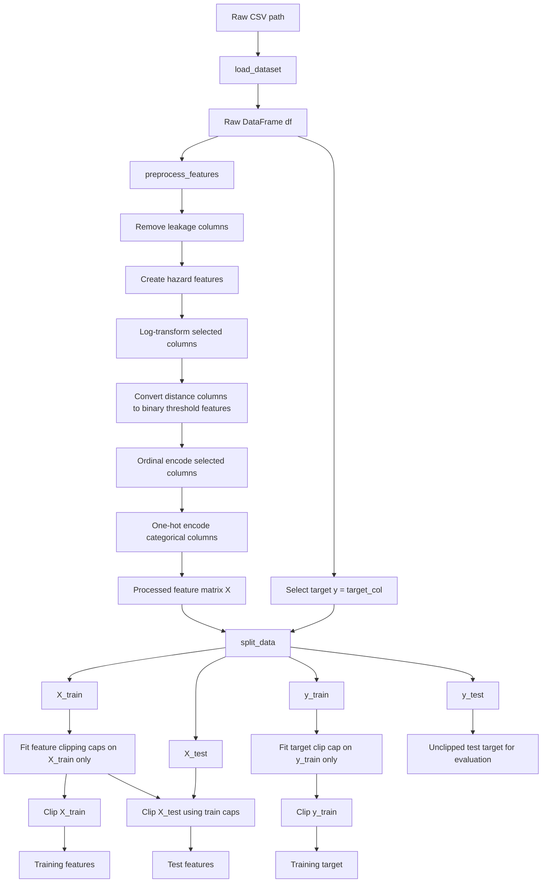
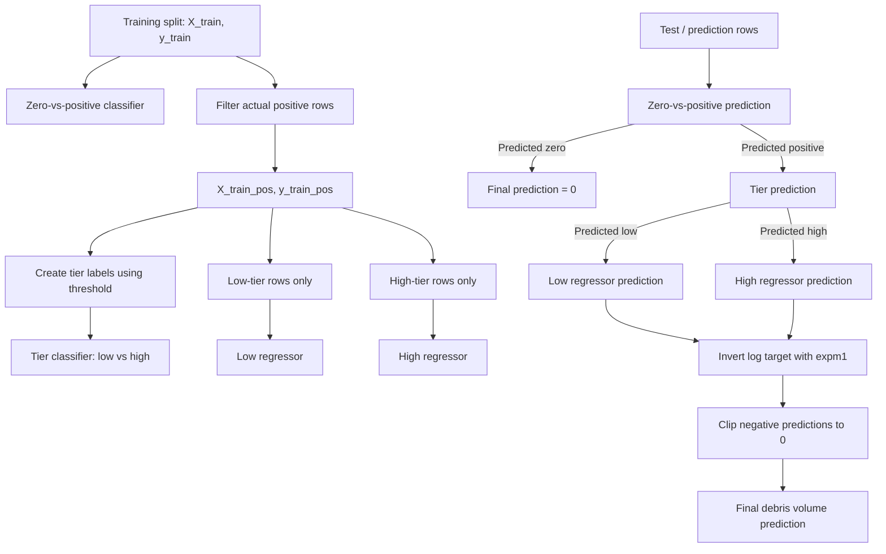

# Debris Estimation

## Project Summary

A modular machine learning pipeline for estimating post-disaster debris volume using staged classification and regression models on geospatial and structural data.

## Setup

Create a python virtual environment

```bash
python3 -m venv .venv
source .venv/bin/activate
```

Install dependencies

```bash
pip install -e .
```

## Project Structure

The reusable pipeline lives under `src/`; executable experiment workflows live under `scripts/`.

```text
src/
  config_presets/        # baseline plus dataset/target-specific config factories
  debris_estimate/
    data/                 # loading, preprocessing, splitting, and clipping
    evaluation/           # metrics and diagnostic plots
    model/                # staged model training and prediction
    sweep/                # sweep summaries, leaderboards, and plots
    config.py             # pipeline configuration dataclasses
    outputs.py            # run and experiment artifact writers
    run.py                # reusable single-run workflow
scripts/                  # sweep, smoke-test, and analysis entry points
data/                     # input CSV datasets
docs/                     # project notes and supporting documentation
```

## Presets and Scripts

Presets cover four datasets (`gh8_v3`, `gh9_v3`, `h8_v3`, and `h9_v6`) and three targets (`both`, `cd`, and `vg`). Each preset module exposes `build_run_config()`, which returns a fresh `RunConfig` with its dataset, target, clipping values, threshold, and model parameters.

```python
from pathlib import Path

from config_presets.gh8_v3 import both
from debris_estimate.run import run_model

config = both.build_run_config()
run_model(config, Path("outputs/runs") / config.run_name)
```

`config_presets` also exports `ALL`, `BOTH`, `CD`, and `VG` collections for running groups of presets.

Sweeps use dotted configuration paths and evaluate the Cartesian product of their values:

```python
from config_presets.gh8_v3 import both
from debris_estimate.config import ExperimentConfig
from scripts.run_sweep import run_sweep

run_sweep(ExperimentConfig(
    experiment_name="gh8_v3_both_thresholds",
    output_dir="outputs/threshold_sweeps",
    base_run_config=both.build_run_config(),
    swept_fields={"model.threshold": [500, 850, 1000]},
))
```

Run scripts from the repository root after installing the package:

| Script | Purpose |
|--------|---------|
| `run_sweep.py` | Example configurable threshold sweep and reusable sweep functions. |
| `run_full_clip_sweep.py` | Sweep feature and target clipping across all presets. |
| `run_full_threshold_sweep.py` | Sweep preset-specific tier thresholds across all presets. |
| `run_full_threshold_clip_sweep.py` | Sweep thresholds and clipping values together across all presets. |
| `run_skew_analysis.py` | Write numeric skew summaries and histograms for each dataset. |
| `run_smoke_test.py` | Legacy end-to-end smoke workflow; it needs migration to the current output and sweep APIs. |

## Data Processing Flow



1. The dataset is loaded from CSV into a raw DataFrame.
2. Feature preprocessing is applied to create the model input matrix `X`.
3. The preset's configured target column is selected separately as `y`.
4. The processed features and raw target are split into train/test sets using shared indices.
5. Feature clipping caps are fit on `X_train` only, then applied to both `X_train` and `X_test`.
6. Target clipping is fit and applied only to `y_train`.
7. The model trains on clipped training features and clipped training targets.
8. Evaluation compares predictions against the original, unclipped `y_test`.

## Model Training and Prediction Flow

The staged model is trained as three connected parts:



### What Each Model Is Trained On

| Model                       | Input rows                          | Target used                             | SMOTE? | Output                                         |
| --------------------------- | ----------------------------------- | --------------------------------------- | ------ | ---------------------------------------------- |
| Zero-vs-positive classifier | All training rows                   | `1` if `y_train > 0`, else `0`          | Yes    | Predicts whether a row has debris              |
| Tier classifier             | Actual positive training rows only  | `0` if `y_train <= threshold`, else `1` | Yes    | Predicts low-tier vs high-tier debris          |
| Low regressor               | Actual positive low-tier rows only  | `log1p(y_train)`                        | No     | Predicts debris volume for low-tier positives  |
| High regressor              | Actual positive high-tier rows only | `log1p(y_train)`                        | No     | Predicts debris volume for high-tier positives |

### Prediction Behavior

During prediction, the model routes each row through the stages:

1. The zero-vs-positive classifier decides whether the row should receive a debris prediction.
2. Rows predicted as zero receive a final prediction of `0`.
3. Rows predicted as positive are passed to the tier classifier.
4. The tier classifier routes each positive row to either the low regressor or high regressor.
5. Regressor predictions are converted back from log space using `expm1`.
6. Negative predictions are clipped to `0`.

### Prediction Results
`predict_staged_model` returns a `PredictionResults` object containing predictions from each stage of the pipeline.

Rows that do not reach a stage are represented as `NaN`. For example, rows predicted as zero debris do not receive tier or regressor predictions. 

| Field                            | Description                               |
| -------------------------------- | ----------------------------------------- |
| `zero_pos_pred`, `zero_pos_prob` | Zero-vs-positive classifier outputs       |
| `tier_pred`, `tier_prob`         | Low/high tier classifier outputs          |
| `low_pred`                       | Low-tier regressor predictions            |
| `high_pred`                      | High-tier regressor predictions           |
| `reg_pred`                       | Combined low/high regressor predictions   |
| `final_pred`                     | Final end-to-end debris volume prediction |

Helper methods are provided to simplify evaluation by automatically aligning predictions with the correct subset of ground-truth values. 

```python
y_tier_true, y_tier_pred, y_tier_prob = preds.tier_pairs(y_true)
y_low_true, y_low_pred = preds.low_pairs(y_true)
y_high_true, y_high_pred = preds.high_pairs(y_true)
y_reg_true, y_reg_pred = preds.reg_pairs(y_true)
```

`final_pred` should be used to evaluate overall system performance, while the pair helper methods are intended for stage-level evaluation and diagnostics.


## Outputs

Single runs write to the directory passed to `run_model`. Sweeps write to:

```text
<output_dir>/<experiment_name>/
  experiment.json
  runs/
    <run_id>/
      config.json
      metrics.json
      predictions.csv
      plots/
  analysis/
    summary.csv
    leaderboard.csv
    plots/
```

### Run Outputs

| File              | Description |
|-------------------|-------------|
| `config.json` | Stores the complete `RunConfig` used to generate the run, including preprocessing, splitting, clipping, and model parameters. |
| `metrics.json` | Stores the complete `EvaluationResults` object, including system-level, classifier, and regressor metrics. |
| `predictions.csv` | Stores one row per sample containing the ground-truth target, final prediction, and stage-level model outputs. |
| `plots/` | Run-level evaluation and diagnostic visualizations. |

### Sweep Analysis Outputs

| File | Description |
|--------|-------------|
| `experiment.json` | The base run configuration, swept fields, and ranking settings. |
| `summary.csv` | Flattened configuration values and metrics for each successful run. |
| `leaderboard.csv` | Successful runs ranked by the configured primary metric and mode. |
| `plots/` | Metric comparisons for each swept field. |

Sweep run IDs include the index and swept values, for example `000_threshold_500_fclip_0p9`. A failed or invalid run is logged and skipped; analysis includes only runs that produced both `config.json` and `metrics.json`.
