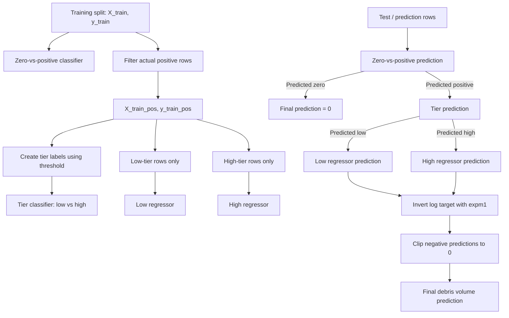

# Debris Estimation

## Project Summary

A modular machine learning pipeline for estimating post-disaster debris volume using staged classification and regression models on geospatial and structural data.

## Project Structure

The repository is structured to separate preprocessing, splitting, modeling, evaluation, plotting, and experiment scripts into reusable modules under `src/`.

```text
src/
  debris_estimate/
    data.py            # dataset loading
    evaluation.py      # model evaluation
    logger.py          # process wide logging
    metrics.py         # metric formulas
    model.py           # staged XGBoost model only
    outputs.py         # standardized output saving
    plots.py           # plot creation and output
    preprocessing.py   # feature preprocessing
    resample.py        # data resampling: SMOTE
    split.py           # train/test splits
scripts/
  run_smoke_test.py    # one-clip, one-threshold staged model smoke check
docs/
  experiments.md       # future experiment ideas and notes
  roadmap.md           # implementation direction
notebooks/             # legacy; core logic extracted
```

## Model Training and Prediction Flow

The staged model is trained as three connected parts:



### What Each Model Is Trained On

| Model                       | Input rows                          | Target used                             | SMOTE? | Output                                         |
| --------------------------- | ----------------------------------- | --------------------------------------- | ------ | ---------------------------------------------- |
| Zero-vs-positive classifier | All training rows                   | `1` if `y_train > 0`, else `0`          | Yes    | Predicts whether a row has debris              |
| Tier classifier             | Actual positive training rows only  | `0` if `y_train <= threshold`, else `1` | Yes    | Predicts low-tier vs high-tier debris          |
| Low regressor               | Actual positive low-tier rows only  | `log1p(y_train)`                        | No     | Predicts debris volume for low-tier positives  |
| High regressor              | Actual positive high-tier rows only | `log1p(y_train)`                        | No     | Predicts debris volume for high-tier positives |

### Prediction Behavior

During prediction, the model routes each row through the stages:

1. The zero-vs-positive classifier decides whether the row should receive a debris prediction.
2. Rows predicted as zero receive a final prediction of `0`.
3. Rows predicted as positive are passed to the tier classifier.
4. The tier classifier routes each positive row to either the low regressor or high regressor.
5. Regressor predictions are converted back from log space using `expm1`.
6. Negative predictions are clipped to `0`.

### Prediction Results

`predict_staged_model` returns a `PredictionResults` object containing the outputs from each stage of the model. All prediction arrays are the same length as the input `X`.

Rows that do not pass through a later model stage are stored as `NaN`. The only exception is `final_pred`, which always contains a usable end-to-end prediction.

| Field           | Meaning                                                                                                                                |
| --------------- | -------------------------------------------------------------------------------------------------------------------------------------- |
| `zero_pos_pred` | Zero-vs-positive class prediction for every row. `0` means predicted zero debris, `1` means predicted positive debris.                 |
| `zero_pos_prob` | Probability that each row has positive debris volume.                                                                                  |
| `tier_pred`     | Low-vs-high tier prediction for rows predicted positive by the zero-vs-positive classifier. `NaN` for predicted-zero rows.             |
| `tier_prob`     | Probability that a predicted-positive row belongs to the high tier. `NaN` for predicted-zero rows.                                     |
| `low_pred`      | Low-regressor prediction for rows routed to the low regressor. `NaN` otherwise.                                                        |
| `high_pred`     | High-regressor prediction for rows routed to the high regressor. `NaN` otherwise.                                                      |
| `reg_pred`      | Combined low/high regressor prediction for rows routed to either regressor. `NaN` for predicted-zero rows.                             |
| `final_pred`    | Final debris volume prediction for every row. Predicted-zero rows receive `0`; predicted-positive rows receive their `reg_pred` value. |

The intended evaluation output for the full staged system is `final_pred`.

Stage-specific predictions are mainly used for diagnostics:

* Use `zero_pos_pred` and `zero_pos_prob` to evaluate the zero-vs-positive classifier.
* Use `tier_pred` and `tier_prob` only on rows where `zero_pos_pred == 1`.
* Use `low_pred` only on rows routed to the low regressor.
* Use `high_pred` only on rows routed to the high regressor.
* Use `reg_pred` only on rows routed to either regressor.

## Setup

Create a python virtual environment

```bash
python3 -m venv .venv
source .venv/bin/activate
```

Install dependencies

```bash
pip install -e .
```
