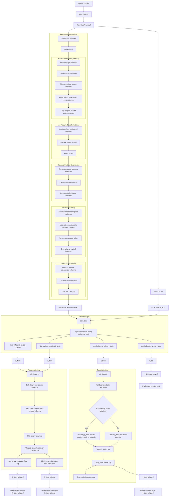

# Detailed Data Processing Flow Chart

```mermaid
flowchart TD
    A[Input CSV path] --> B[load_dataset]
    B --> C[Raw DataFrame df]

    C --> D[preprocess_features]
    
    subgraph PRE[Feature preprocessing]
        D --> E[Copy raw df]
        E --> F[Drop leakage columns]

        subgraph HAZ[Hazard Feature Engineering]
            F --> G[Create hazard features]
            G --> G1[Check required source columns]
            G1 --> G2[Apply min or max across source columns]
            G2 --> G3[Drop original hazard source columns]
        end

        subgraph LOG[Log Feature Transformatrions]
            G3 --> H[Log-transform configured columns]
            H --> H1[Validate column exists]
            H1 --> H2[Apply log1p]
        end

        subgraph DIST[Distance Feature Engineering]
            H2 --> I[Convert distance features to binary]
            I --> I1[Create threshold feature]
            I1 --> I2[Drop original distance columns]
        end

        subgraph ORD[Ordinal Encoding]
            I2 --> J[Ordinal encode configured columns]
            J --> J1[Map category values to ordered integers]
            J1 --> J2[Warn on unmapped values]
            J2 --> J3[Drop original ordinal columns]
        end

        subgraph CAT[Categorical Encoding]
            J3 --> K[One-hot encode categorical columns]
            K --> K1[Create dummy columns]
            K1 --> K2[Drop first category]
        end
    end

    K2 --> L[Processed feature matrix X]

    C --> M[Select target]
    M --> N[y = df VolBoth_sum]

    L --> O[split_data]
    N --> O

    subgraph SPLIT[Train/test split]
        O --> P[Split row indices using train_test_split]
        P --> Q[Use indices to select X_train]
        P --> R[Use indices to select X_test]
        P --> S[Use indices to select y_train]
        P --> T[Use indices to select y_test]
    end

    Q --> U[X_train]
    R --> V[X_test]
    S --> W[y_train]
    T --> X[y_test]

    U --> Y[clip_features]
    V --> Y

    subgraph FCLIP[Feature clipping]
        Y --> Z[Select numeric feature columns]
        Z --> AA[Exclude configured clip-exempt columns]
        AA --> AB[Skip binary columns]
        AB --> AC[Fit upper quantile caps on X_train only]
        AC --> AD[Clip X_train to range 0 to cap]
        AC --> AE[Clip X_test using same train-fitted caps]
    end

    AD --> AF[X_train_clipped]
    AE --> AG[X_test_clipped]

    W --> AH[clip_targets]

    subgraph TCLIP[Target clipping]
        AH --> AI[Validate target clip percentile]
        AI --> AJ{Positive-only target clipping?}
        AJ -->|Yes| AK[Use only y_train values greater than 0 for quantile]
        AJ -->|No| AL[Use all y_train values for quantile]
        AK --> AM[Fit upper target cap]
        AL --> AM
        AM --> AN[Clip y_train above cap]
        AN --> AO[Return clipping summary]
    end

    AN --> AP[y_train_clipped]
    X --> AQ[y_test unchanged]

    AF --> AR[Model training input X_train_clipped]
    AP --> AS[Model training target y_train_clipped]

    AG --> AT[Model prediction input X_test_clipped]
    AQ --> AU[Evaluation target y_test]
```
